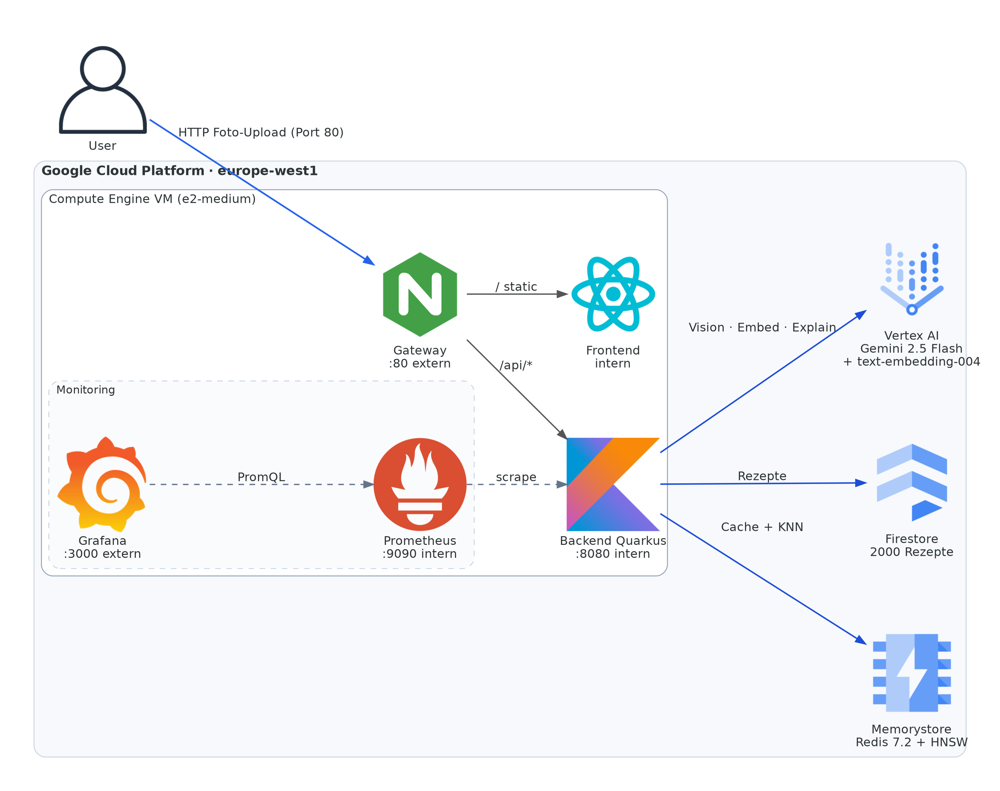

# Restekoch

[](https://github.com/fpuhlig/restekoch/actions/workflows/ci.yml)
[](LICENSE)

Scan your fridge, get recipe ideas. Photo in, recipes out.

Upload a photo of ingredients. Gemini Vision identifies them, a vector search over 2000 indexed recipes returns the best matches, and a two-tier cache short-circuits repeated and similar requests.



## Stack

Kotlin + Quarkus, React + Vite, Nginx, Redis (HNSW), Firestore, Vertex AI (Gemini 2.5 Flash, text-embedding-004), Terraform, Ansible, Prometheus, Grafana.

## Run locally

```bash
docker compose up --build
```

App on http://localhost. Without GCP credentials the backend uses mocks for Gemini and embeddings (CDI `@DefaultBean`).

## Deploy

```bash
cd terraform && terraform apply
cd .. && ./scripts/update-vault.sh
cd ansible && ansible-playbook playbook.yml
```

## Tests

```bash
cd backend && ./gradlew test            # 100 JUnit tests (Quarkus + Testcontainers)
cd frontend && pnpm test                # 57 Vitest tests
```

## Load tests

Four k6 scenarios under `load-tests/`, run from the production VM. Measured numbers in `docs/load-test-results.md`.

## Layout

```
backend/     Kotlin + Quarkus
frontend/    React + Vite
gateway/     Nginx (routing, rate limit, security headers)
terraform/   GCP infrastructure
ansible/     Deployment
monitoring/  Prometheus + Grafana
load-tests/  k6 scenarios
docs/adr/    Architecture decisions
```

## License

MIT
